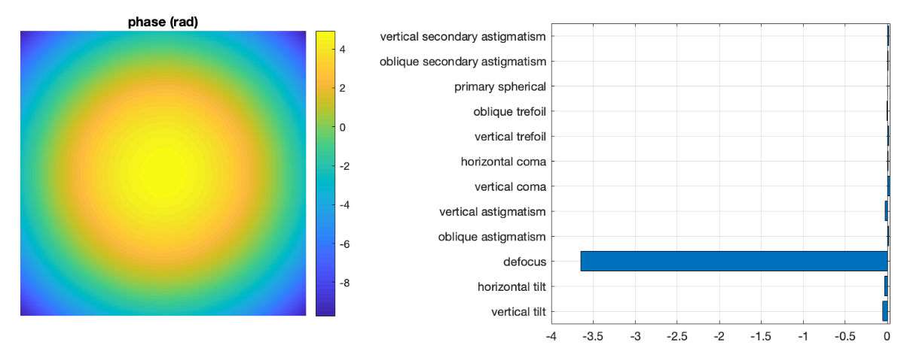

# diffuserwavefrontsensor


## Introduction
Wavefront sensors are used to characterize aberrations optical systems.
A commonly used design is known as the [Shack–Hartmann wavefront sensor](https://en.wikipedia.org/wiki/Shack%E2%80%93Hartmann_wavefront_sensor), which is simply a microlens array at _1f_ from a CCD or CMOS chip.
The array segments the pupil so the position of the focal spot under each lenslet depends on the local wavefront tilt. 
The Shack–Hartmann sensor can not measure discontinuous phase steps. 

An alternative solution working along similar principles was presented by [Berto, et al. 2017](https://www.osapublishing.org/ol/abstract.cfm?uri=ol-42-24-5117).
These authors place a thin holographic diffuser at a known distance in front of a camera sensor. 
Coherent light striking the diffuser projects a pattern onto the sensor. 
It is intuitive that altering the incident angle of the incoming light will translate the pattern across the sensor. 
Therefore local tilts in wavefront will distort the pattern. 
The sensor operates by obtaining a reference image and a test image then calculating the deformation required to map the test image onto the reference. 
The resulting deformation field can be turned into a phase map across the sensor. 


## Building a sensor
To explore the possibility of using such a sensor in the optics lab I put together a device from the following parts:
* [1° Holographic diffuser from Edmund Optics](https://www.edmundoptics.com/p/1deg-diffusing-angle-25mm-dia-mounted/8192/)
* [acA4112-20uc - Basler ace camera](https://www.baslerweb.com/en/products/cameras/area-scan-cameras/ace/aca4112-20uc/) with a large 14.1 mm x 10.3 mm sensor
* [SM1A9 C-Mount to SM1 adapter](https://www.thorlabs.com/thorproduct.cfm?partnumber=SM1A9)
* [SM1L05 lens tube](https://www.thorlabs.com/thorproduct.cfm?partnumber=SM1L05)
* You can use an [SM1T2](https://www.thorlabs.com/thorproduct.cfm?partnumber=SM1T2) to mount the camera to an [SM1 lens mount](https://www.thorlabs.com/thorproduct.cfm?partnumber=SMR1/M) or [cage plate](https://www.thorlabs.com/newgrouppage9.cfm?objectgroup_id=2273).

Once assembled, the diffuser ends up about about 16 mm from the CMOS chip.
Increasing the distance between the diffuser and the chip will increase the sensitivity of the device (see Berto). 
Any monochrome camera would work, of course, but the large sensor size of the Basler is nice to have. 
Also very nice to have is a portable laser coupled to a single-mode fibre. 
I bought a [ThorLabs HLS635](https://www.thorlabs.com/thorproduct.cfm?partnumber=HLS635) and a [2m single-mode patch cable](https://www.thorlabs.com/thorproduct.cfm?partnumber=P1-630A-FC-2). 
You probably also want an [SM1FC mounting plate](https://www.thorlabs.com/thorproduct.cfm?partnumber=SM1FC) to mount the free fibre tip. 


## Assembling a test jig
A single-mode fibre serves as a convenient point source from which emanates a spherical wavefront.
The effect is similar to placing a negative lens in front of a laser, but since the fibre behaves as a point source the resulting wavefront should be aberration-free and perfectly spherical.
Mount the fibre to a [translation stage](https://www.thorlabs.com/thorproduct.cfm?partnumber=PT1#ad-image-0), placing it a short distance (one meter or so) from the camera. 
Take a reference image, translate the fibre a few hundred microns and make a measurement. 
You should obtain a wavefront that resembles the [Zernike polynomial](https://en.wikipedia.org/wiki/Zernike_polynomials) that [corresponds to defocus](https://www.telescope-optics.net/zernike_aberrations.htm). 

This works because the sag of the wavefront across the sensor varies with distance from the fibre tip.
Translate the fibre a few hundred microns the other way and the wavefront plot should invert. 


## Running the software
The software runs in MATLAB from the command line (no GUI yet) and is based on a code snippet kindly provided by Marc Guillon. 
A sample session would go like this:


* Create an instance of the `diffusersensor` class in the base workspace
```
d=diffusersensor
```

* Assuming if you have a compatible camera with a single acquisition mode, a window will now appear with a live stream from the camera sensor. 
If you have multiple cameras or multiple acquisition modes you will see someting like the following at the command line, prompting you to choose an acquisitoin scenario.
```
>> d=diffusersensor;
No devices were detected for the 'winvideo' adaptor. For troubleshooting device detection issues, click here.
1  -  videoinput('gentl', 1, 'Mono12')
2  -  videoinput('gentl', 1, 'Mono8')

Enter device number and press return: 2
>> 
```

* Change the gain on the camera if the image is saturated or too dim.
These commands may be device specific. 
On Basler cameras, for instance, do:
```
 >> d.cam.src.ExposureTime=200;
```
 
* Set up your optical system to acquire a reference image then: 
```
d.setReference
```

* You will see the reference image overlaid onto the current live image in red/green.
You can calculate the wavefront shape at any time by running:

```
d.getPhase
```

* The results are stored in the objects properties. 

* Other stuff to try:

```
% Stop and start the video
d.stopVideo 
d.startVideo


% Do a translation correction of the last acquired image to the 
% the reference before calculating the wavefront
d.transCor = true;
d.getPhase

d.transCor = false; % return to default value

% Speed up the calculation
d.resizeBy = 0.5;
d.getPhase


% Calculate the phase shifts only by don't plot
d.calcPhase

% Close the phase display window and re-make it without re-calculating
d.plotWavefront
```

### Settings
To get meaningful numbers in the phase plot you should edit the `dws_settings.m` file so that pixel size, wavelength, and distance to the diffuser are correct. 
